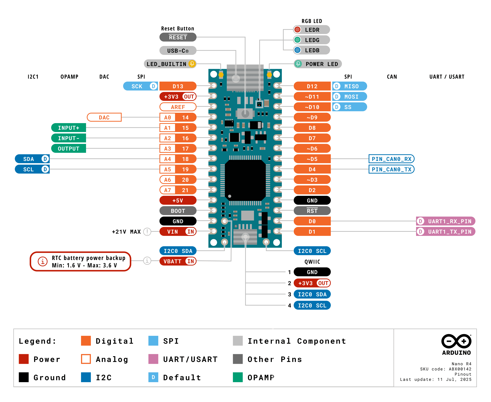

# Arduino Nano R4

Der **Arduino Nano R4** ist das Board, das wir in diesem Kurs verwenden. Er liest Taster und Sensoren ein, steuert LEDs oder Displays und kann sich über USB-C als Tastatur, Maus oder Mediensteuerung am Computer anmelden.

## Das Wichtigste auf einen Blick

| Eigenschaft | Arduino Nano R4 |
| --- | --- |
| Mikrocontroller | Renesas RA4M1, 32-Bit Arm Cortex-M4 |
| Taktfrequenz | 48 MHz |
| Speicher | 256 kB Flash, 32 kB RAM, 8 kB EEPROM |
| Logikspannung | 5 V; nur der Qwiic-Anschluss arbeitet mit 3,3 V |
| Anschlüsse | 14 digitale Pins, 8 analoge Eingänge, USB-C und Qwiic |
| Besonderheiten | HID, PWM, DAC, RTC, I²C, SPI, UART und CAN |

Über **USB-C** wird das Board mit Strom versorgt, programmiert und mit dem seriellen Monitor verbunden. Der kleine Formfaktor passt gut auf ein Breadboard.

!!! warning "Pins nicht überlasten"

    Ein Ein-/Ausgangspin darf mit höchstens **8 mA** belastet werden. LEDs benötigen einen Vorwiderstand. Motoren, Relais, LED-Streifen und andere größere Verbraucher dürfen nie direkt an einem Pin betrieben werden; dafür ist eine passende Treiberstufe notwendig.

## Pinout

{width="60%"}

### So liest und verwendest du das Pinout

Halte das Board wie im Bild: **USB-C befindet sich oben**, der **Qwiic-Anschluss unten**. Die grauen Linien zeigen, zu welchem Kontakt am Board eine Beschriftung gehört. Die Farben ordnen die Pins nach ihrer Funktion. Ein Pin kann mehrere Funktionen besitzen; im Sketch verwendest du immer die Bezeichnung, die direkt am Pin steht, zum Beispiel `D4` beziehungsweise `4` oder `A0`.

#### Häufig verwendete Pins

| Beschriftung im Bild | Verwendung | Beispiel im Sketch |
| --- | --- | --- |
| `D0` bis `D21` | Digitale Ein- und Ausgänge. `D14` bis `D21` sind dieselben Kontakte wie `A0` bis `A7` | `pinMode(4, OUTPUT);` |
| `A0` bis `A7` | Analoge Eingänge. Bei digitaler Verwendung entsprechen sie `D14` bis `D21` | `analogRead(A0);` |
| `~D3` `~D5` `~D6` `~D9` `~D10` `~D11` | PWM, zum Beispiel zum Dimmen einer LED | `analogWrite(3, 128);` |
| `GND` | Gemeinsamer Minuspol der Schaltung | Mit GND des Bauteils verbinden |
| `+5V` / `+3V3` | Versorgungsausgänge für passende Bauteile | Spannung des Bauteils vorher prüfen |
| `LED_BUILTIN` | Eingebaute orange LED | `digitalWrite(LED_BUILTIN, HIGH);` |

!!! tip "Pins im Code eindeutig benennen"

    Lege die verwendeten Pins am Anfang deines Sketches fest. So lässt sich die Verdrahtung später leicht ändern.

    ```cpp
    const byte tasterPin = 2;
    const byte ledPin = 3;
    ```

#### Kommunikationsanschlüsse

* **I²C:** `A4` ist `SDA`, `A5` ist `SCL`. Dieser Bus wird im Code mit `Wire` angesprochen. Der separate Qwiic-Anschluss führt ebenfalls I²C, arbeitet aber mit 3,3 V und verwendet `Wire1`.
* **SPI:** `D10` ist `SS/CS`, `D11` ist `MOSI/COPI`, `D12` ist `MISO/CIPO` und `D13` ist `SCK`.
* **UART:** `D0` ist `RX` und `D1` ist `TX`. Diese Pins gehören zu `Serial1`; `Serial` läuft über USB-C.
* **CAN:** `D4` ist `CAN TX`, `D5` ist `CAN RX`. Zwischen Arduino und CAN-Leitung ist immer ein externer CAN-Transceiver erforderlich.

Wenn ein Pin für eine Schnittstelle verwendet wird, sollte er nicht gleichzeitig eine zweite Aufgabe übernehmen. Beispiel: Während I²C aktiv ist, nutzt du `A4` und `A5` nicht zusätzlich als analoge Eingänge.


## Stromversorgung richtig anschließen

Für die ersten Versuche ist **USB-C** die einfachste und sicherste Stromversorgung. Für ein eigenständig betriebenes Projekt kann eine externe Spannung von **6 bis 21 V** an `VIN` und `GND` angeschlossen werden. Verwechsle `VIN` nicht mit den Versorgungsausgängen `+5V` und `+3V3`.

!!! danger "Vor dem Umstecken"

    Trenne USB und externe Stromversorgung, bevor du die Schaltung veränderst. Verbinde niemals eine Versorgungsspannung mit einem digitalen oder analogen Signalpin. Der Qwiic-Anschluss und seine Module arbeiten mit **3,3 V**, die normalen GPIO-Pins des Nano R4 mit **5 V**.
