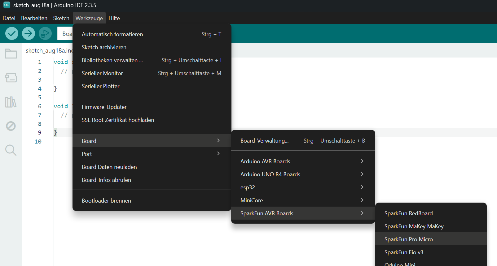
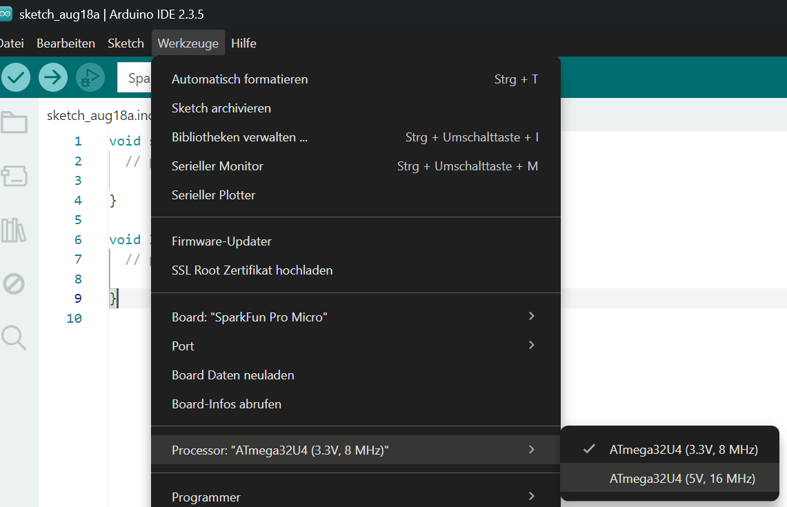
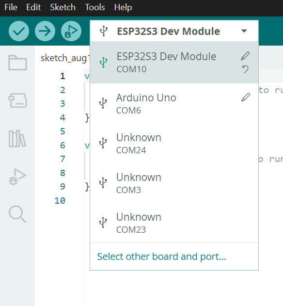

# 🛠️ Arduino IDE einrichten

Mit der Arduino IDE schreibst und überträgst du deine Programme. Für das Qwiic Pro Micro Board muss zusätzlich das passende SparkFun-Boardpaket installiert und das richtige Board ausgewählt werden.

## Einrichtung

1. Öffne die Arduino IDE auf deinem PC. Falls du die IDE zu Hause noch installieren möchtest, kannst du das unter diesem [Link](https://www.arduino.cc/en/software/){ target="_blank" } machen.
2. Öffne **Datei → Einstellungen**.
3. Ergänze bei **Zusätzliche Boardverwalter-URLs** diese Adresse:  
```
https://raw.githubusercontent.com/sparkfun/Arduino_Boards/main/IDE_Board_Manager/package_sparkfun_index.json
```  
Drücke dannach `OK`.
4. Öffne den **Boardverwalter** auf der linken Seitenleiste, suche nach `SparkFun AVR Boards` und installiere das Paket.
5. Wähle unter **Werkzeuge → Board → Sparkfun AVR Boards** den Eintrag **Sparkfun Pro Micro**.  
{width="65%"}
6. Wähle unter **Werkzeuge → Processor** Variante **ATmega32U4, 5 V, 16 MHz**.  
{width="60%"}
7. Wähle den richtigen Com-Port in der Boarauswahl aus.  
Diesen findes du heraus indem du das Board ein, und dann wieder aus steckst. Dieser Port der neu in der Liste erscheint ist der richtige.  
{width="30%"}  
Drücke dannach im Pop-Up-Fenster **OK**.


## IDE-Erklärung

- Der Haken in der Arduino IDE **überprüft** den Sketch und sucht nach Fehlern.
- Der Pfeil **lädt** den Sketch auf das Board.
- Beim Hochladen wird der Code zuerst übersetzt und danach über den gewählten Port übertragen.
- Das kurze Aufleuchten und die längere Pause zeigen, dass der neue Sketch wirklich läuft.
