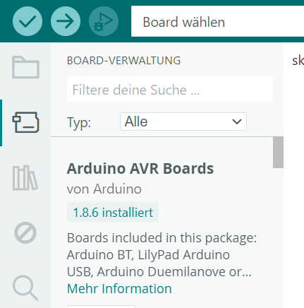
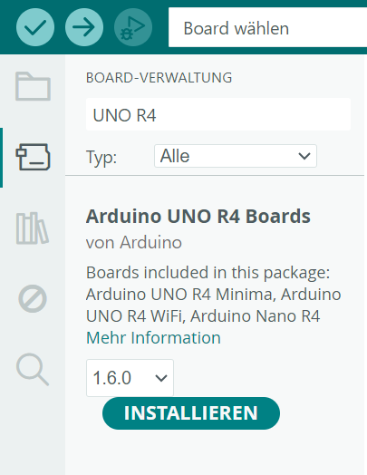

# 🛠️ Arduino IDE einrichten

Mit der Arduino IDE schreibst und überträgst du deine Programme. Für den Arduino Nano R4 installierst du einmal das offizielle Boardpaket **Arduino UNO R4 Boards** und wählst danach Board und USB-Port aus.

## Einrichtung

1. Öffne die Arduino IDE auf deinem PC. Falls du sie zu Hause installieren möchtest, findest du sie auf der [offiziellen Downloadseite](https://www.arduino.cc/en/software/){ target="_blank" }.
2. Öffne links den **Boardverwalter**.  
{width="35%"}
3. Suche nach `UNO R4` und installiere die aktuelle Version von **Arduino UNO R4 Boards**. Das Paket stammt von Arduino und enthält die Unterstützung für den Nano R4.  
{width="35%"}
4. Verbinde den Nano R4 mit einem **USB-C-Datenkabel** mit dem Computer. Ein reines Ladekabel funktioniert nicht zum Programmieren.
5. Öffne oben das Dropdown **Board wählen** und wähle **Arduino Nano R4** aus.  
{width="35%"}

## IDE-Erklärung

- Der Haken in der Arduino IDE **überprüft** den Sketch und sucht nach Fehlern.
- Der Pfeil **lädt** den Sketch auf das Board.
- Beim Hochladen wird der Code zuerst übersetzt und danach über den gewählten Port übertragen.
- Die eingebaute orange LED kann mit `LED_BUILTIN` angesprochen werden. Ein Blink-Sketch ist deshalb ein guter erster Funktionstest.
