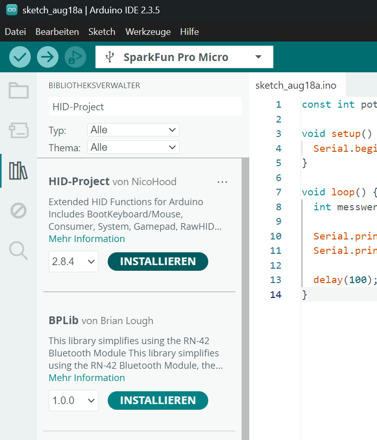

# 📖 Arduino-Libraries installieren

Libraries erweitern die Arduino IDE um zusätzliche Funktionen. Sie werden zum Beispiel benötigt, um bestimmte Sensoren, Displays oder Kommunikationsmodule einfacher im eigenen Programm verwenden zu können. Für die HID-Projekte dieses Kurses werden ausschließlich `Keyboard.h`, `Mouse.h` und `ConsumerKeyboard.h` verwendet. Eigene HID-Libraries oder selbst angelegte Headerdateien sind nicht nötig.

## Library über den Library Manager installieren

1. Öffne die **Arduino IDE** auf deinem PC.

2. Öffne auf der linken Seitenleiste den **Bibliotheksverwalter**.

3. Suche oben im Suchfeld nach dem Namen der gewünschten Library.  
   {width="35%"}
   
4. Wähle die passende Library aus der Ergebnisliste aus.

5. Drücke auf **Installieren**.

6. Falls die Arduino IDE zusätzliche Abhängigkeiten installieren möchte, bestätige diese ebenfalls mit **Install All** beziehungsweise **Alle installieren**.

7. Nach der Installation kann die Library direkt in einem Sketch verwendet werden.
